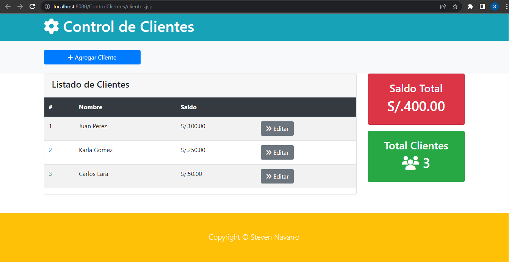
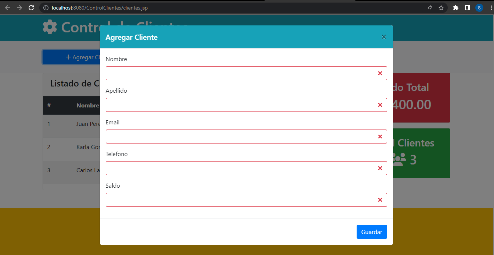
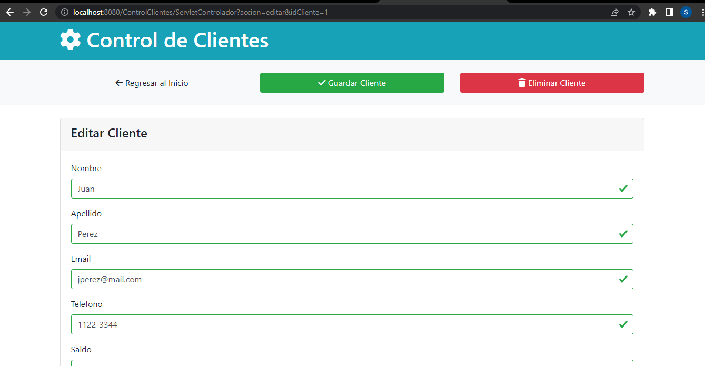

# CRUD de Clientes - Java, Servlets, JSP y Bootstrap

Este es un proyecto de CRUD (Create, Read, Update, Delete) de clientes implementado en Java con Servlets, JSP y Bootstrap. Permite realizar operaciones básicas sobre una base de datos de clientes, como agregar nuevos clientes, ver la lista de clientes existentes, actualizar información y eliminar clientes.

## Requisitos previos

Antes de ejecutar el proyecto, asegúrate de tener instalado lo siguiente:

1. JDK 8 o superior (Java Development Kit)
2. Netbeans IDE 17
3. GlassFish Server
4. Base de datos MySQL y el controlador JDBC correspondiente.

## Configuración de la base de datos

1. Crea una base de datos llamada "control_clientes" en tu servidor de base de datos.

2. Ejecuta el siguiente script SQL para crear la tabla de clientes:

    ```sql
    CREATE TABLE cliente (
      id_cliente INT PRIMARY KEY AUTO_INCREMENT,
      nombre VARCHAR(45),
      apellido VARCHAR(45),
      email VARCHAR(45),
      telefono VARCHAR(45),
      saldo VARCHAR(45)
    );
    ```

3. Asegúrate de tener el controlador JDBC configurado en el archivo `web/WEB-INF/web.xml`

## Como ejecutar el proyecto

1. Clona este repositorio o descarga los archivos como ZIP.
2. Importa el proyecto en tu IDE Netabeans.
3. Configura el GlassFish Server en tu IDE.
4. Ejecuta el proyecto en el servidor GlassFish.
5. Abre tu navegador web y accede a http://localhost:8080/ControlClientes/clientes.jsp para ver la aplicación en funcionamiento.

## Capturas de pantalla

A continuación, se muestran algunas capturas de pantalla del funcionamiento del proyecto:

1. Página de inicio:

	

2. Formulario para agregar clientes:

	

3. Formulario para editar o eliminar clientes:

	
